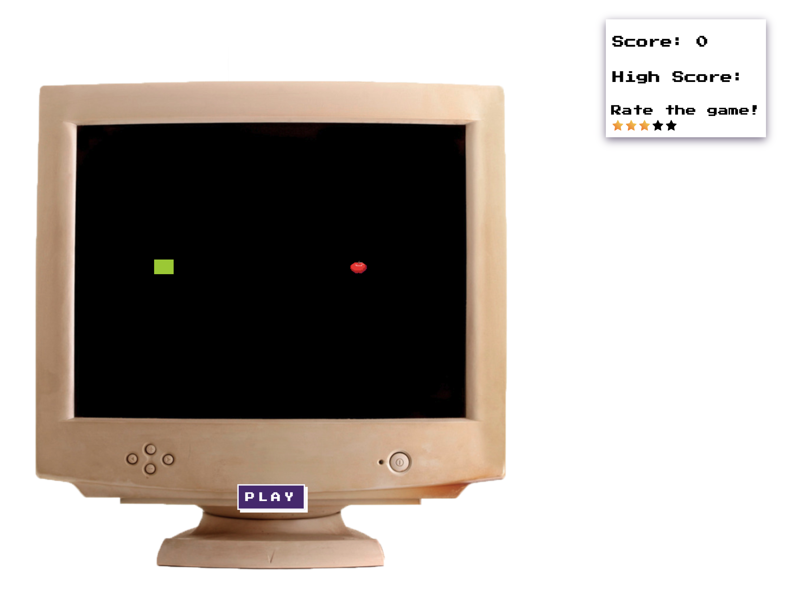

# Sample project with `FeedbackApi`

[Demo](https://strong-cobbler-c29afe.netlify.app/)

It is react js application with [`Feedback API`](https://rapidapi.com/blips-and-chitz-blips-and-chitz-default/api/feedback-api5) integration by using [SDK](https://www.npmjs.com/package/blips-and-chitz-feedback-api-sdk) package. 

In this sample you can rate game, give for 1 to 5 stars.

In code implemented in [`Rate.tsx`](./src/Rate.tsx) which used [`useFeedbackApi`](./src/hooks/useFeedbackApi.tsx) hook.

# Snake Game

## Technologies

- React
- TypeScript

## Start

1. Make `.env` file from `.dist.env`. Change `REACT_APP_RAPID_API_KEY` to your Rapid Api Key.
1. Install dependencies  
`yarn`
1. Run  
`yarn start`
